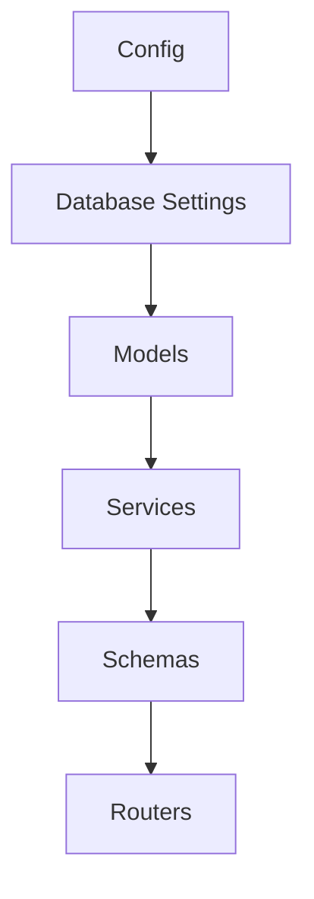

# To-Do List Mini Web App (FastAPI + SQLite + Redis)

A small API-first to-do list web app with a minimal UI, built on FastAPI, persisting to SQLite, and using Redis for read caching. The project includes comprehensive unit and integration tests.

## Features

- FastAPI + SQLModel (SQLite) persistence, auto-create tables on startup
- Redis for caching, with degradation when cache is down.
- Code quality tooling: ruff (lint) and black (format)

## Quick Start

Prereqs: Python 3.10+. Redis is optional for local dev (if not running, the app gracefully degrades and just misses cache).

1) Install dependencies (pick one)

```bash
# Using uv (recommended)
uv sync

# Or using venv + pip
python -m venv .venv
source .venv/bin/activate
pip install .
```

2) Start Redis (Homebrew, optional but recommended for caching)

```bash
brew install redis
redis-server

# Verify it's running
redis-cli ping
# -> PONG
```

3) Start the API (pick one)

```bash
# Option A: use the provided launcher (recommended)
python runme.py

# Option B: run with uvicorn
uvicorn app.main:app --reload
```

4) Open in your browser

- Web UI: http://127.0.0.1:8000/
- API docs (Swagger): http://127.0.0.1:8000/docs

## API Overview

Base path: `/api`

- POST `/api/todos` – create a to-do
- GET `/api/todos` – filters + search
- GET `/api/todos/{id}` – fetch a single to-do
- PATCH `/api/todos/{id}` – partial update
- DELETE `/api/todos/{id}` – delete a to-do
- GET `/api/todos/stats` – statistics (total/completed/pending)

Requests and responses are validated/transformed with Pydantic.

## Caching Design (Redis)

- Invalidation: any create/update/delete clears the corresponding `todo:{id}` and all `todos:list:*`; stats key `todos:stats` is also cleared on data changes
- Graceful degradation: if Redis is unavailable, the app falls back to DB reads with logs (no crashes)

<!-- Redis startup instructions are covered in Quick Start (Homebrew only) -->

## Environment & Configuration

Managed via environment variables (case-insensitive, see `app/config.py`):

- `LOG_LEVEL` (default `INFO`)
- `DATABASE_URL` (default `sqlite:///./todos.db`)
- `REDIS_URL` or components: `REDIS_HOST`/`REDIS_PORT`/`REDIS_PASSWORD`/`REDIS_DB`
- `CACHE_TTL` (default 30)
- Pagination: `DEFAULT_PAGE_SIZE` (default 5), `MAX_PAGE_SIZE` (default 100)

Use a local `.env` (create one) or export in your shell.

## Module Structure & Completion Order (Flowchart)

I implemented in this order:



Brief notes:

- Config: env settings
- Database Settings: create engine/session, auto-create tables, etc
- Models: SQLModel tables, fields, timestamps, enums
- Services: business logic (CRUD, filters/search/pagination, stats) and cache service
- Schemas: Pydantic request/response models with strict validation
- Routers: HTTP layer for param parsing, service wiring, error handling

## How I Used AI to Build and Learn This Project

This is an exercise with AI as both coach and pair programmer:

1. Asked AI to read `project_requirement.md` and extract the required tech and architecture
2. Studied the fundamental tech and architecture by myself
3. Requested a proposed project structure and a recommended completion order (the flowchart above), with responsibilities for each layer
4. Implemented modules one by one. For each module:
	 - First, asked AI to draft the internal functions/classes design (inputs/outputs, function description)
	 - Reviewed and adjusted the design
	 - Implemented the module, then used another AI as a second pass reviewer
	 - After each module, asked AI to generate pytest tests (happy path + key edge cases)
5. After integration, added end-to-end and cache behavior tests to ensure the whole system works as intended

The outcome is a small but well-structured, test-friendly, and maintainable app, and I learned a lot by this way.